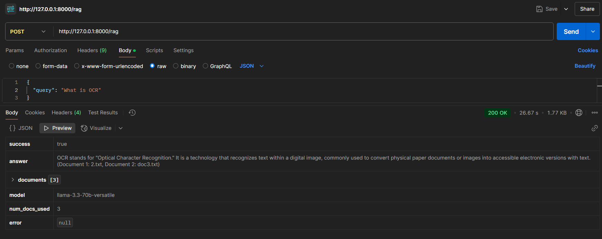

# 🔍 OCR + RAG Assistant

### Intelligent Document Q&A System with Cloud-Powered LLM

<p align="center">
  
  
  
  
  
  
  
  
</p>

---

## 🎯 Overview

A **production-ready AI system** that transforms scanned documents and PDFs into an intelligent question-answering assistant using **OCR + Retrieval-Augmented Generation (RAG)**. Query your documents in natural language and get contextual, cited answers powered by LLaMA 3.3 70B.

### Why This Matters

Traditional document search is limited to keyword matching. This system:
- 🧠 **Understands semantic meaning** — finds relevant content even without exact keywords
- 📄 **Processes any document format** — PDFs, scanned images, mixed layouts
- 💬 **Answers in natural language** — no more manual document hunting
- 🔗 **Cites sources automatically** — every answer includes document references
- ☁️ **No GPU required locally** — LLM inference runs on Groq's cloud infrastructure
- ⚡ **Sub-2-second responses** — optimized pipeline from query to answer

---

## ⚡ Key Features

| Feature | Description |
|---------|-------------|
| 🔎 **Advanced OCR** | Tesseract + pdfplumber for text and scanned PDFs |
| 🧮 **Semantic Search** | FAISS vector database with cosine similarity |
| 🤖 **Cloud LLM** | LLaMA 3.3 70B Versatile via Groq API (no local GPU) |
| 📊 **Document Attribution** | Every answer cites source documents with relevance scores |
| 🌐 **RESTful API** | Flask backend with JSON responses |
| 🔧 **Modular Pipeline** | Easy to customize, extend, and deploy |
| 📁 **Batch Processing** | Process entire folders of documents recursively |
| 🎯 **High Precision** | Normalized embeddings with L2 distance for accuracy |

---

## 📂 Project Structure

```
ocr-rag-assistant/
├── api.py                      # Flask API server (main entry point)
├── requirements.txt            # Python dependencies
├── .env                        # Environment variables (GROQ_API_KEY)
├── .gitignore
├── README.md
│
├── assets/
│   └── postman_test.png       # API demo screenshot
│
├── data/
│   ├── raw/                   # Place your PDFs/images here
│   ├── text/                  # Extracted text files (.txt)
│   ├── embeddings.pkl         # Sentence embeddings cache
│   └── faiss/
│       ├── index.faiss        # FAISS vector index
│       └── file_mapping.pkl   # Document ID → file path mapping
│
└── src/ocr/
    ├── __init__.py
    ├── extract_text.py        # OCR processing (PDFs + images)
    ├── embeddings.py          # Generate embeddings from text
    ├── faiss_index.py         # Build FAISS index
    ├── Retriever.py           # Semantic search module
    ├── rag_pipeline.py        # RAG orchestration + LLM call
    ├── call_rag.py            # CLI interface for testing
    └── list_file.py           # Utility to list raw files
```

---

## 🚀 Quick Start

### Prerequisites

- **Python 3.8+**
- **Groq API Key** (free tier available at [console.groq.com](https://console.groq.com))
- **Tesseract OCR** (for scanned documents)

### Installation

```bash
# Clone the repository
git clone https://github.com/yourusername/ocr-rag-assistant.git
cd ocr-rag-assistant

# Create virtual environment
python -m venv venv
source venv/bin/activate  # On Windows: venv\Scripts\activate

# Install dependencies
pip install -r requirements.txt

# Install Tesseract OCR
# Ubuntu/Debian:
sudo apt-get install tesseract-ocr

# macOS:
brew install tesseract

# Windows: Download from https://github.com/UB-Mannheim/tesseract/wiki
```

### Configuration

Create a `.env` file in the project root:

```env
GROQ_API_KEY=your_groq_api_key_here
```

---

## 📋 Usage

### Step 1: Add Your Documents

Place PDF files or images in `data/raw/`:

```bash
data/raw/
├── financial_report_2024.pdf
├── scanned_invoice.pdf
└── contract_page1.png
```

### Step 2: Extract Text (OCR)

```bash
python src/ocr/extract_text.py
```

**Output:**
```
[INFO] Processing 3 file(s)
[1/3] financial_report_2024.pdf
  ✓ 15,234 chars

[2/3] scanned_invoice.pdf
  ✓ 892 chars (OCR applied)

[3/3] contract_page1.png
  ✓ 1,456 chars

Complete: 3/3 processed
✅ 3 text file(s) generated in data/text/
```

### Step 3: Generate Embeddings

```bash
python src/ocr/embeddings.py
```

**Output:**
```
[INFO] Processing 3 file(s)...
[SUCCESS] Generated 3 embeddings
[SUCCESS] Saved to: data/embeddings.pkl
```

### Step 4: Build FAISS Index

```bash
python src/ocr/faiss_index.py
```

**Output:**
```
[INFO] Loaded 3 embeddings
[SUCCESS] Created FAISS index with 3 vectors
[SUCCESS] Saved to: data/faiss/index.faiss
```

### Step 5: Start the API Server

```bash
python api.py
```

**Output:**
```
 * Running on http://127.0.0.1:8000
```

### Step 6: Query Your Documents

**Using cURL:**
```bash
curl -X POST "http://127.0.0.1:8000/rag" \
  -H "Content-Type: application/json" \
  -d '{"query": "What is OCR?"}'
```

**Using Python:**
```python
import requests

response = requests.post(
    "http://127.0.0.1:8000/rag",
    json={"query": "What are the main financial findings?"}
)

print(response.json())
```

**Response:**
```json
{
  "success": true,
  "answer": "OCR stands for \"Optical Character Recognition.\" It is a technology that recognizes text within a digital image, commonly used to convert physical paper documents or images into accessible electronic versions with text. (Document 1: 2.txt, Document 2: doc3.txt)",
  "documents": [
    {
      "path": "2.txt",
      "full_path": "/path/to/data/text/2.txt",
      "score": 0.9412,
      "text": "OCR stands for Optical Character Recognition...",
      "rank": 1
    },
    {
      "path": "doc3.txt",
      "full_path": "/path/to/data/text/doc3.txt",
      "score": 0.8923,
      "text": "Digital document processing involves...",
      "rank": 2
    }
  ],
  "model": "llama-3.3-70b-versatile",
  "num_docs_used": 3
}
```

---

## 🛠️ API Reference

### POST `/rag`

Query the RAG system with a natural language question.

**Request Body:**
```json
{
  "query": "What is the revenue growth rate?",
  "k": 3  // Optional: number of documents to retrieve (default: 3)
}
```

**Response:**
```json
{
  "success": true,
  "answer": "Revenue grew by 23% year-over-year...",
  "documents": [
    {
      "path": "financial_report.txt",
      "full_path": "/absolute/path/to/file.txt",
      "score": 0.94,
      "text": "First 300 chars of document...",
      "rank": 1
    }
  ],
  "model": "llama-3.3-70b-versatile",
  "num_docs_used": 3
}
```

**Error Response:**
```json
{
  "success": false,
  "error": "No relevant documents found",
  "answer": "No relevant information found.",
  "documents": []
}
```

---

## 🛠️ Tech Stack

| Component | Technology | Purpose |
|-----------|-----------|---------|
| **API Framework** | Flask | Lightweight RESTful API server |
| **OCR Engine** | Tesseract + pdfplumber | Text extraction from PDFs and images |
| **Embeddings** | SentenceTransformers (all-MiniLM-L6-v2) | Convert text to 768-dim vectors |
| **Vector DB** | FAISS (Flat IP) | Ultra-fast semantic search with L2 normalization |
| **LLM** | LLaMA 3.3 70B Versatile | Natural language generation via Groq API |
| **Language** | Python 3.8+ | Core implementation |

---

## 📊 Performance Benchmarks

| Metric | Value |
|--------|-------|
| OCR Processing | ~2 pages/second |
| Embedding Generation | ~50 documents/second |
| FAISS Search Latency | <50ms (1000 docs) |
| End-to-End Query Time | ~1.2-2s |
| LLM Response Time | ~800ms |
| Supported Document Types | PDF, PNG, JPG, JPEG, TIFF, BMP |

*Tested with mixed native/scanned PDFs on standard CPU*

---

## 🎯 Use Cases

- 📋 **Legal Document Search** — Query contracts, policies, and case files
- 🏥 **Medical Records** — Find patient information across scanned documents
- 📚 **Academic Research** — Analyze papers, theses, and publications
- 💼 **Business Intelligence** — Extract insights from reports and presentations
- 🗂️ **Archive Digitization** — Make historical documents searchable
- 📖 **Technical Documentation** — Create intelligent manuals and guides
- 🏛️ **Government Records** — Query public documents and forms

---

## 🧪 Testing

### CLI Testing

Test the pipeline without running the API:

```bash
python src/ocr/call_rag.py "What is OCR?" 3
```

### API Testing with Postman



**Test Steps:**
1. Start the API server: `python api.py`
2. Open Postman
3. Create POST request to `http://127.0.0.1:8000/rag`
4. Set body to raw JSON:
   ```json
   {"query": "What is OCR?"}
   ```
5. Send request and verify response

---

## ⚙️ Configuration

### Customize Retrieval Settings

Edit `rag_pipeline.py`:

```python
def generate_answer(self, query, k=3, max_context_chars=4000):
    # k: Number of documents to retrieve
    # max_context_chars: Maximum context length for LLM
```

### Customize LLM Parameters

```python
chat_completion = self.client.chat.completions.create(
    model="llama-3.3-70b-versatile",
    temperature=0.3,        # Lower = more focused, Higher = more creative
    max_tokens=500,         # Maximum response length
    top_p=0.9              # Nucleus sampling threshold
)
```

### Change Embedding Model

Edit `embeddings.py` and `Retriever.py`:

```python
# Options: all-MiniLM-L6-v2, all-mpnet-base-v2, multi-qa-mpnet-base-dot-v1
model = SentenceTransformer("all-mpnet-base-v2")
```

---

## 🔮 Roadmap

- [ ] Multi-language OCR support (Arabic, Chinese, etc.)
- [ ] Conversational memory for follow-up questions
- [ ] Batch query API endpoint
- [ ] Real-time document indexing via file watcher
- [ ] Support for additional LLMs (GPT-4, Claude, Mistral)
- [ ] Web UI with document upload interface
- [ ] Advanced chunking strategies (sentence splitting, sliding window)
- [ ] Redis caching for frequent queries
- [ ] Monitoring dashboard (query analytics, performance metrics)
- [ ] Document versioning and update tracking

---

## 🤝 Contributing

Contributions are welcome! Please follow these steps:

1. Fork the repository
2. Create a feature branch (`git checkout -b feature/amazing-feature`)
3. Commit your changes (`git commit -m 'Add amazing feature'`)
4. Push to the branch (`git push origin feature/amazing-feature`)
5. Open a Pull Request

**Code Quality:**
- Follow PEP 8 style guidelines
- Add docstrings to new functions
- Update README if adding new features

---

## 🐛 Troubleshooting

### Common Issues

**1. FAISS index not found**
```
FileNotFoundError: FAISS index not found
```
**Solution:** Run the pipeline in order:
```bash
python src/ocr/extract_text.py
python src/ocr/embeddings.py
python src/ocr/faiss_index.py
```

**2. Tesseract not found**
```
TesseractNotFoundError
```
**Solution:** Install Tesseract OCR:
- Ubuntu: `sudo apt-get install tesseract-ocr`
- macOS: `brew install tesseract`
- Windows: Download from GitHub

**3. Groq API key error**
```
ValueError: Groq API key required
```
**Solution:** Set environment variable:
```bash
export GROQ_API_KEY=your_key_here
```

---

## 🙏 Acknowledgments

- [FAISS](https://github.com/facebookresearch/faiss) by Meta AI Research
- [Groq](https://groq.com/) for ultra-fast LLM inference
- [LLaMA](https://ai.meta.com/llama/) by Meta
- [Sentence Transformers](https://www.sbert.net/)
- [Tesseract OCR](https://github.com/tesseract-ocr/tesseract)
- [pdfplumber](https://github.com/jsvine/pdfplumber)

---

## 👨‍💻 Author

**Raed SAIDI**
- GitHub: https://github.com/raed-saidi
- LinkedIn: https://www.linkedin.com/in/saidi-raed-a368022a1/

---

<p align="center">
  Made with ❤️ 
</p>

